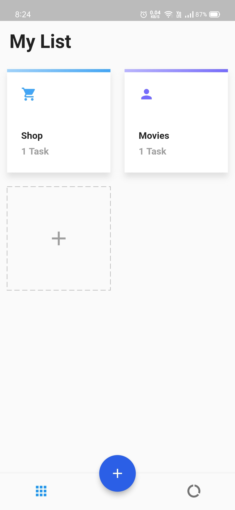
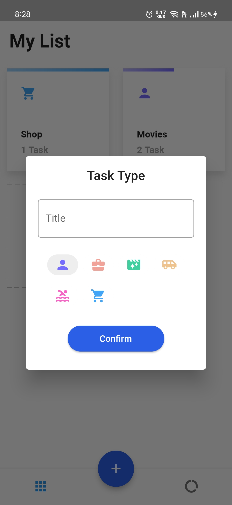
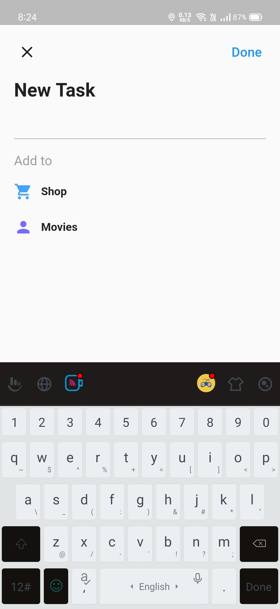
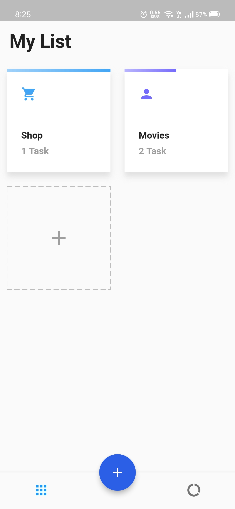
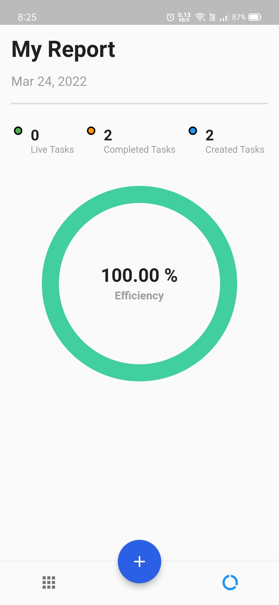

# TODO

A flutter application to manage personal tasks with ease.

[![Watch the video]](https://drive.google.com/file/d/1pGj2Yc2-N61BBiQ_RD8wyB0lFZqm9sIQ/view?usp=sharing)

#### Features: 

1. Organize Task Types
2. Create tasks
3. Mark tasks as completed
4. Delete tasks
5. View progress
6. Analyze live reports.

#### Approach: 

The project follows **MVC architecture** with **GetX** as a StateManagement library. TODO project has an eye-catching UI and faster response. Also, it has a strong backend with GetX __Controller, Bindings and Service__ 

######_Check out the repository's release for installing APK._

## Getting Started

- [Lab: Write your first Flutter app](https://flutter.dev/docs/get-started/codelab)
- [Cookbook: Useful Flutter samples](https://flutter.dev/docs/cookbook)

[online documentation](https://flutter.dev/docs)